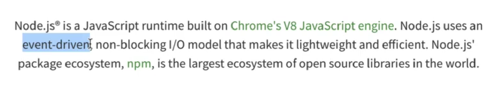
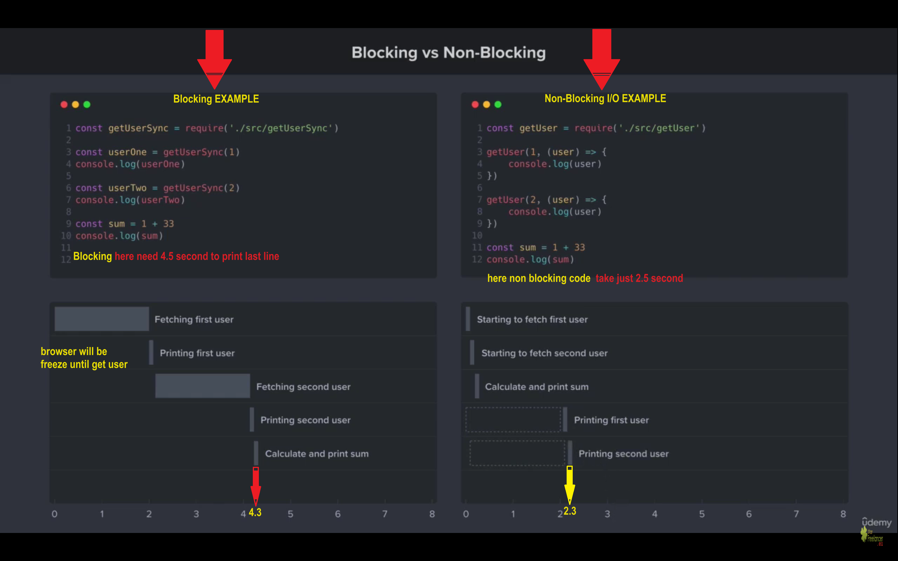
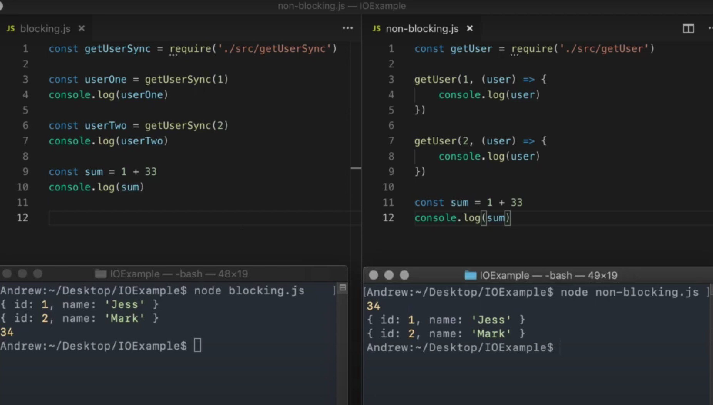

# 2. what is node js ?



1.  -   chrome and nodejs are both use V8 ENGINE they pass code to it and results returns back to them
2.  -   chrome and nodejs are both largely written in cpp also V8 ENGINE

3.  -   in node we don't have [Browser](Browser) or [Document](Document) as we don't in browser and we don't have dom elements in server

4.  -   node js instead uses [Global](Global) [instead of windows] and uses [Process](Process) [instead of document]

5.  -   let's try `console.log(global)` ~~~~ `console.log(process)`
6.  -   A Node.js app runs in a single process, without creating a new thread for every request. Node.js provides a set of asynchronous I/O primitives in its standard library that prevent JavaScript code from blocking and generally, libraries in Node.js are written using non-blocking paradigms, making blocking behavior the exception rather than the norm.
7.  -   When Node.js performs an I/O operation like reading from the network, accessing a database or the filesystem, instead of blocking the thread and wasting CPU cycles waiting, Node.js will resume the operations when the response comes back.
8.  -   I/O operation [I stands for => input , O stands for => Output](I/O)
9.  -   This allows Node.js to handle thousands of concurrent connections with a single server without introducing the burden of managing thread concurrency, which could be a significant source of bugs.
        
        

# 3. Importing Nodejs Core Modules

1.  -   to import any of node js core modules we user [require] function
2.  -   to import file system node module we use {require("fs")}
        -   we will create file app.js then write 👇👇👇
        ```
        const fs = require('fs');
        fs.writeFileSync("text.txt","hello this file is created by nodejs!.")
        ```
        -   this will create new file called text.txt in the same path
        -   to append new message to the same created file we can use
            `fs.appendFileSync("text.txt","\nthis is a new message will be add to text.txt file.")`

### importing your own files

1.  -   if you have app.js file and utils file you want to import utils in app.js file you can use `require("./utils")`
2.  -   in utils file you can use `module.exports = {function1,function2}`
3.  -   in app.js file you can use `const {function1,function2} = require("./utils")`

### <span style="background-color:#f00; padding:4px">NPM</span>

-   npm is the standard package manager for Node.js.
-   npm manages downloads of dependencies of your project.
-   first `npm init -y`
-   then `npm install {your package}`
-   let's try some awesome packages

#### [chalkPackage](https://www.npmjs.com/package/chalk)

-   this package used to color your console log messages
-   to install [npm i chalk@4.0.0]
-   this package used to color your console log messages with colors
-   to use you can try 👇👇👇

    ```js
    const chalk = require('chalk');
    const log = console.log;

    // Combine styled and normal strings
    log(chalk.blue('Hello') + ' World' + chalk.red('!'));

    // Compose multiple styles using the chainable API
    log(chalk.blue.bgRed.bold('Hello world!'));

    // Pass in multiple arguments
    log(chalk.blue('Hello', 'World!', 'Foo', 'bar', 'biz', 'baz'));

    // Nest styles
    log(chalk.red('Hello', chalk.underline.bgBlue('world') + '!'));

    // Nest styles of the same type even (color, underline, background)
    log(
    	chalk.green(
    		'I am a green line ' +
    			chalk.blue.underline.bold('with a blue substring') +
    			' that becomes green again!',
    	),
    );

    // ES2015 template literal
    log(`
        CPU: ${chalk.red('90%')}
        RAM: ${chalk.green('40%')}
        DISK: ${chalk.yellow('70%')}
        `);

    // Use RGB colors in terminal emulators that support it.
    log(chalk.rgb(123, 45, 67).underline('Underlined reddish color'));
    log(chalk.hex('#DEADED').bold('Bold gray!'));
    ```

#### [nodemon](https://www.npmjs.com/package/nodemon)

-   nodemon is a tool that helps develop Node.js based applications by automatically restarting the node application when file changes in the directory are detected.
-   to install nodemon `npm i nodemon -g`
-   to be sure that we install it `nodemon -v`
-   to use `nodemon app.js`

# 4. File system and command line args

#### [process] it is a big object

-   process.exit()
-   process.abort()
-   process.argv

    -   property returns an array containing the command-line arguments passed when the Node.js process was launched.

        1.  -   The first element will be process.execPath. See process.argv0 if access to the original value of argv[0] is needed.
        2.  -   The second element will be the path to the JavaScript file being executed.
        3.  -   The remaining elements will be any additional command-line arguments.
        4.  -   we can use command line arguments like

        5.  -   in your terminal write {`node app.js add --title="this is my new title"`}

        ```js
        [
        	'C:\\Program Files\\nodejs\\node.exe',
        	'C:\\Users\\hodas\\Desktop\\nodejs tutorial\\app.js',
        	'args',
        ];
        ```

        ```js
        let command = process.argv[2];
        if (command === 'add') console.log('add new note...');
        if (command === 'remove') console.log('remove old note...');
        ```

## How to parse process.argv

-   we will use npm package called `yargs`
-   to install `npm i yargs`
-   to use `yargs` and get useful information

```js
const yargs = require('yargs');
console.log(yargs.argv);
//{ _: [ 'add' ], title: 'this is my new title', '$0': 'app.js' }
```

-   now if we write in terminal `node app.js --help`
-   we will get 👇👇👇

```js
Options:
  --help     Show help                                                 [boolean]
  --version  Show version number                                       [boolean]

```

-   now let's try `node app.js --version` we will see 👉👉 `1.0.0`
-   let's try to change version we will use `yargs.version("1.1.1")`
-   then in terminal let's show version using `node app.js --version`
